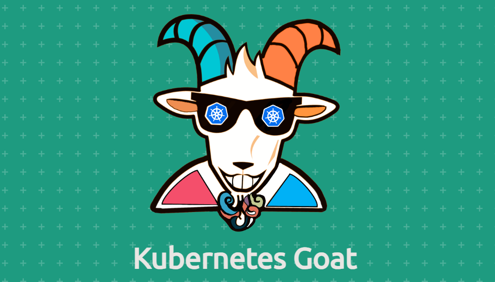

# Kubernetes Goat



[👋 Introduction | Kubernetes Goat](https://madhuakula.com/kubernetes-goat/docs/)

# Scenarios

1. Container Escape to the Host System
Exploit: This scenario demonstrates how attackers can exploit misconfigured privileged containers to escape a Docker container and gain access to the host system.
Impact: Once the attacker escapes, they can gain host-level privileges, manipulate Kubernetes nodes, and potentially compromise the entire Kubernetes cluster.
Lesson: Avoid granting unnecessary privileges to containers, especially HostPath mounts, to prevent such security breaches.
2. RBAC Least Privileges Misconfiguration
Exploit: Attackers exploit overly permissive RBAC (Role-Based Access Control) settings to access sensitive Kubernetes secrets using service accounts.
Impact: Using service accounts tied to a pod, the attacker can extract API secrets and credentials, like the k8svaultapikey, compromising sensitive resources.
Lesson: Enforce the principle of least privilege in RBAC configurations to limit access to only the necessary Kubernetes resources.
3. Sensitive Keys in Codebases
Exploit: Sensitive information like API keys and credentials committed in code repositories can be exposed and exploited by attackers.
Impact: Publicly accessible version control systems can leak critical data, such as AWS keys and environment variables, leading to security breaches.
Lesson: Scan codebases regularly for sensitive information, and avoid committing secrets or credentials to version control systems.

# Installation

1. https://kubernetes.io/docs/tasks/tools/install-kubectl-linux/ (check you architecture `uname -m`)
2. https://minikube.sigs.k8s.io/docs/start/?arch=/windows/x86-64/stable/.exe+download (also install [docker](https://www.kali.org/docs/containers/installing-docker-on-kali/))
3. https://helm.sh/docs/intro/install/ 
4. https://madhuakula.com/kubernetes-goat/docs/ (Follow rest of the steps)

# Running kube-goat

- **Start Minikube** (if using Minikube):
    
    `minikube start`
    
- **Check if Pods are Running**:
    
    `kubectl get pods`
    
- Restart Containers:
    
    `kubectl rollout restart deployment`
    

# 1 - Container escape to the host system

https://madhuakula.com/kubernetes-goat/docs/scenarios/scenario-4/container-escape-to-the-host-system-in-kubernetes-containers/welcome

- **Scenario**: Privileged container escape to the host system in Kubernetes environments due to common misconfigurations.
- **Goal**: Escape from a Docker container to the host system and use this access to gain node-level privileges and query Kubernetes resources.

### Overview

In this scenario, you'll explore security misconfigurations in Kubernetes clusters, particularly how granting unnecessary privileges can lead to security issues. A container with elevated privileges (like `HostPath`) may allow an attacker to gain access to the host system and compromise the entire cluster.

You'll learn how to:

- Exploit a container escape vulnerability.
- Test for and exploit misconfigurations in privileged containers.
- Understand the security risks associated with common container and Kubernetes misconfigurations.

---

### Objectives

- Escape from the Docker container and gain access to the host system.
- Obtain the node-level kubeconfig file to interact with the Kubernetes cluster.
- Explore the Kubernetes nodes using the compromised credentials.
- Learn about container misconfigurations and their consequences.

---

### Steps

1. **Run the script**: `bash access-kubernetes-goat.sh`
    - **Reason**: This sets up the Kubernetes Goat environment with vulnerable configurations, allowing you to explore misconfigurations and container security flaws.
2. **Check container privileges**:
    - Run `capsh --print` to print out the container's capabilities.
    - Use the `mount` command to see if the host system is mounted (for example, at `/host-system`).
    - **Reason**: Misconfigured containers may mount sensitive directories from the host, exposing them to attackers.
3. **Explore the mounted host system**:
    - `ls /host-system/`
    - **Reason**: The `/host-system` directory may give you direct access to the host's file system, where you can explore and manipulate system files.
4. **Escape the container using `chroot`**:
    - `chroot /host-system bash`
    - **Reason**: By switching the root directory to `/host-system`, you can gain access to the host’s shell environment and operate with host-level privileges.
5. **List running Kubernetes pods**:
    - Use `crictl pods` to view the containers running on the host.
    - **Reason**: After escaping the container, you may want to explore the host system's container environment, especially the running Kubernetes pods.
6. **Access Kubernetes configuration**:
    - Read the Kubernetes configuration using: `cat /etc/kubernetes/admin.conf`
    - **Reason**: This file contains the kubeconfig for the node, allowing you to interact with the Kubernetes cluster as a privileged node.
7. **Install kubectl**:
    - Use the available binary at `/var/lib/minikube/binaries/v1.31.0/kubectl`.
    - **Reason**: The `kubectl` tool allows you to interact with Kubernetes resources. It's often installed on nodes, and you can use it with the kubeconfig you obtained.
8. **Query Kubernetes resources**:
    - Run the following command to list all resources in the Kubernetes system namespace:
        - `./kubectl --kubeconfig /etc/kubernetes/admin.conf get all -n kube-system`
    - **Reason**: This allows you to see critical information about the Kubernetes cluster resources.
9. **List available nodes**:
    - Run `./kubectl --kubeconfig /etc/kubernetes/admin.conf get nodes`
    - **Reason**: By obtaining the list of nodes, you can further exploit and gain control over the Kubernetes cluster.

---

### Summary

In this scenario, you exploited a misconfigured privileged container to escape from the Docker container to the host system. By leveraging tools such as `chroot`, you gained host-level access, allowing you to explore and manipulate the Kubernetes node, ultimately obtaining the kubeconfig file for further access to the Kubernetes cluster.

This scenario highlights the risks associated with overly permissive containers and underscores the need for proper container security configurations, such as avoiding unnecessary privileges and ensuring containers are isolated from the host system.

# 2 - RBAC least privileges misconfiguration

https://madhuakula.com/kubernetes-goat/docs/scenarios/scenario-16/rbac-least-privileges-misconfiguration-in-kubernetes-cluster/welcome

- **Scenario**: Overly permissive RBAC (Role-Based Access Control) settings allow attackers to gain access to sensitive Kubernetes resources.
- **Goal**: Exploit RBAC misconfigurations to gain access to secrets and sensitive information, such as the `k8svaultapikey` secret.

### Overview

RBAC (Role-Based Access Control) is a security feature in Kubernetes that helps enforce the principle of least privilege. However, many real-world Kubernetes deployments have misconfigurations that provide broader access than necessary, which attackers can exploit to escalate privileges and access sensitive data.

In this scenario, you’ll learn how to:

- Use Kubernetes service accounts to interact with the Kubernetes API.
- Exploit overly permissive RBAC policies to access secrets and other sensitive resources.

---

### Objectives

- Use a service account bound to a Kubernetes pod to query the API server.
- Leverage the API to extract the `k8svaultapikey` secret.
- Understand the risks associated with RBAC misconfigurations and how to prevent them.

---

### Steps

1. **Access the service account token**:
    - Navigate to the service account token directory:`cd /var/run/secrets/kubernetes.io/serviceaccount/`
    - **Reason**: Kubernetes stores authentication tokens for each pod’s service account here. These tokens can be used to interact with the Kubernetes API.
2. **Set environment variables for the API interaction**:
    - Export the internal API server hostname:`export APISERVER=https://${KUBERNETES_SERVICE_HOST}`
    - Export the service account token and other necessary paths:
        
        ```bash
        bash
        Copy code
        export SERVICEACCOUNT=/var/run/secrets/kubernetes.io/serviceaccount
        export TOKEN=$(cat ${SERVICEACCOUNT}/token)
        export NAMESPACE=$(cat ${SERVICEACCOUNT}/namespace)
        export CACERT=${SERVICEACCOUNT}/ca.crt
        
        ```
        
    - **Reason**: These variables allow you to securely communicate with the API server using the pod's service account.
3. **Query the Kubernetes API**:
    - List all secrets in the default namespace:`curl --cacert ${CACERT} --header "Authorization: Bearer ${TOKEN}" -X GET ${APISERVER}/api/v1/secrets`
    - **Reason**: The service account token might have permissions to read secrets, revealing sensitive information such as API keys or flags.
4. **Query secrets in a specific namespace**:
    - To query secrets in the current namespace, run:`curl --cacert ${CACERT} --header "Authorization: Bearer ${TOKEN}" -X GET ${APISERVER}/api/v1/namespaces/${NAMESPACE}/secrets`
    - **Reason**: Kubernetes stores secrets at the namespace level. This helps narrow down the search for sensitive information in the targeted namespace.
5. **Query pods in the namespace**:
    - To list the running pods, execute:`curl --cacert ${CACERT} --header "Authorization: Bearer ${TOKEN}" -X GET ${APISERVER}/api/v1/namespaces/${NAMESPACE}/pods`
    - **Reason**: Understanding what pods are running may help in further exploration of the cluster.
6. **Find and extract the `k8svaultapikey`**:
    - Use `grep` to search for the `k8svaultapikey` in the secrets:`curl --cacert ${CACERT} --header "Authorization: Bearer ${TOKEN}" -X GET ${APISERVER}/api/v1/namespaces/${NAMESPACE}/secrets | grep k8svaultapikey`
    - **Reason**: The `k8svaultapikey` secret is what you're after to find the flag in this scenario.
7. **Decode the secret**:
    - Once you have the base64 encoded secret, decode it using:`echo "<base64-value>" | base64 -d`
    - **Reason**: Kubernetes secrets are encoded in base64 for storage, so you'll need to decode them to read the actual values.

---

### Summary

In this scenario, you exploited overly permissive RBAC configurations to gain access to sensitive Kubernetes secrets using a service account bound to a pod. By interacting with the Kubernetes API server, you successfully extracted the `k8svaultapikey` and revealed the hidden flag.

This scenario demonstrates the importance of properly configuring RBAC permissions to prevent unauthorized access to critical resources like secrets and other sensitive data.

# 3 - Sensitive keys in codebases

https://madhuakula.com/kubernetes-goat/docs/scenarios/scenario-1/sensitive-keys-in-codebases-in-kubernetes-containers/welcome

- **Scenario**: Sensitive keys in codebases; common misconfigurations by developers/DevOps.
- **Goal**: Identify sensitive keys (AWS keys, Kubernetes Goat flag) in the codebase, including application code and container infrastructure.

### Overview

- Developers may commit sensitive information to version control systems.
- Test for security misconfigurations, packaging errors, and sensitive data exposure.

---

### Objectives

- How to test security misconfigurations in web application entry points
- Common mistakes or misconfigurations of packaging applications and containers
- Detecting sensitive keys and information in version control system codebases
- Using open-source tools to identify and detect secrets

---

### Steps

- **Run script**: `bash access-kubernetes-goat.sh`
    - **Reason**: This script is used to start the Kubernetes Goat environment locally. It sets up the vulnerable application so you can start exploring security weaknesses (e.g., sensitive data exposure).
- **Access `.git` config**: `http://127.0.0.1:1230/.git/config`
    - **Reason**: The `.git` folder contains the version control information for the application. If it’s publicly accessible, attackers can potentially download the entire repository, including sensitive files like credentials.
- **Install `git-dumper`**: `pip3 install git-dumper`
    - **Reason**: Installing the tool allows you to use it to dump the exposed Git repository for further analysis.
- **Dump the repository**: `git-dumper http://localhost:1230/.git git_extract`
    - **Reason**: This command extracts the entire Git repository from the exposed `.git` folder, allowing you to analyze the code and commit history locally. In real-world attacks, this would be where attackers look for sensitive information.
- **Explore commits**: `git log`, then `git checkout <commit id>`
    - **Reason**: `git log` shows the history of commits, which could include sensitive information in older versions of the code. Checking out specific commits (`git checkout <commit id>`) allows you to look at the project state at a particular point in time.
- **List files**: `ls -la`, then check `.env` for sensitive info (flags).
    - **Reason**: The `.env` file often contains environment variables such as API keys, database passwords, and access credentials. Listing hidden files (`ls -la`) helps find files like `.env` that are often used to store sensitive information. Running `cat .env` reveals the contents, which might include hardcoded credentials or flags for pentesting exercises.

---

### Summary

In this scenario, you exploited sensitive information such as API keys and secrets that were unintentionally exposed within a version control system. By accessing publicly exposed Git repositories and using open-source tools, you successfully extracted sensitive information, such as AWS keys and the Kubernetes Goat flag.

This scenario emphasizes the importance of securely managing and scanning codebases for exposed credentials, ensuring that sensitive keys are not committed to version control systems, and properly securing access to those systems to avoid potential data leaks.
